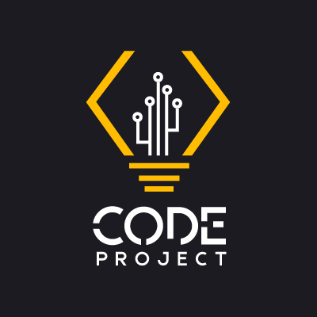

<h1 align="center">
 
</h1>

<h3 align="center">
 An API for a technology education platform
</h3>

<div align="center">
  
  
  
</div>

<p align="center">
  <a href="#features">Features</a>&nbsp;&nbsp;&nbsp;|&nbsp;&nbsp;&nbsp;
  <a href="#dependencies">Dependencies</a>&nbsp;&nbsp;&nbsp;|&nbsp;&nbsp;&nbsp;
  <a href="#prerequisites">Prerequisites</a>&nbsp;&nbsp;&nbsp;|&nbsp;&nbsp;&nbsp;
  <a href="#getting-started">Getting started</a>&nbsp;&nbsp;&nbsp;|&nbsp;&nbsp;&nbsp;
  <a href="#routes">Routes</a>&nbsp;&nbsp;&nbsp;|&nbsp;&nbsp;&nbsp;
  <a href="#contributing">Contributing</a>&nbsp;&nbsp;&nbsp;|&nbsp;&nbsp;&nbsp;
  <a href="#license">License</a>
</p>

## Features

A Node.js API built with Express and all the latest tools and best practices in development!

- :zap: **Express** — A web framework for Node
- :floppy_disk: **Sequelize** — SQL dialect ORM for Node.js
- :fallen_leaf: **MongoDB** — document-based database
- :key: **Redis** — key-value data model
- :straight_ruler: **Yup** - Object schema validation
- :red_circle: **Sentry** - cross-platform application monitoring
- :mailbox: **Nodemailer** - Send e-mails with Node.JS
- :hearts: **Lint** — ESlint/Prettier/Editor Config

## Dependencies

- [Node.js](https://nodejs.org/en/)
- [Yarn](https://classic.yarnpkg.com/pt-BR/docs/install)
- [Docker](https://www.docker.com/)

## Prerequisites

_In the next few weeks, I plan to include Docker directly in the repository with docker-compose, until there this step is required._

To run this server you will need three containers running on your machine.

To do so, you will need to run the following commands:

- `docker run --name redisbarber -p 6379:6379 -d -t redis:alpine`;
- `docker run --name mongobarber -p 27017:27017 -d -t mongo`;
- `docker run --name some-postgres -e POSTGRES_PASSWORD=docker -p 5433:5432 -d postgres`;

_Remember: If you restart your machine, you will need to start again the server with `docker start <container_id>`._

## Getting started

1. Clone this repo using `https://github.com/greysonmrx/CodeProject-Backend.git`
2. Move to the appropriate directory: `cd CodeProject-Backend`.<br />
3. Run `yarn` to install dependencies.<br />
4. Copy the `.env.example` file and rename it to `.env`.<br/>
5. Add all the values for the environment variables.<br/>
6. Run `yarn start` and `yarn queue` to run the servers at `http://localhost:5000`.

## Routes

- `POST /users`: The route must provide `id`, `first_name`, `last_name`, `email`, `unencrypted_password` inside the body and register a new user in the database and return a response with this format: `{ id: "1", first_name: "New", last_name: "User", "email": new@user.com }`;

- `GET /users`: Route that lists all users;

- `PUT /users/:id`: The route should only change the first_name, last_name and email of the user with the `id` present in the parameters of the route;

- `DELETE /users/:id`: The route must delete the user with the `id` present in the route parameters;

- You can see all the routes in [Insomnia](https://insomnia.rest/);

<br/>
<div align="center">

[](https://insomnia.rest/run/?label=Code%20Project&uri=https%3A%2F%2Fraw.githubusercontent.com%2Fgreysonmrx%2FCodeProject-Backend%2Fmaster%2Finsomnia.json)

</div>

### Exemple

If I call the route `POST /users` by passing on `{ id: "1", first_name: "New", last_name: "User", "email": new@user.com }`, my return should be this:

```js
[
  {
    id: '1',
    first_name: 'Greyson',
    last_name: 'Mascarenhas',
    email: 'greysonmrx@gmail.com',
    created_at: '2020-02-08T16:50:00',
    updated_at: '2020-02-08T16:50:00'
  }
];
```

## Contributing

Please read [CONTRIBUTING.md](CONTRIBUTING.md) for details on our code of conduct, and the process for submitting pull requests.

## License

This project is licensed under the MIT License - see the [LICENSE.md](LICENSE.md) file for details.

Made with :hearts: by Code Project :wave:
